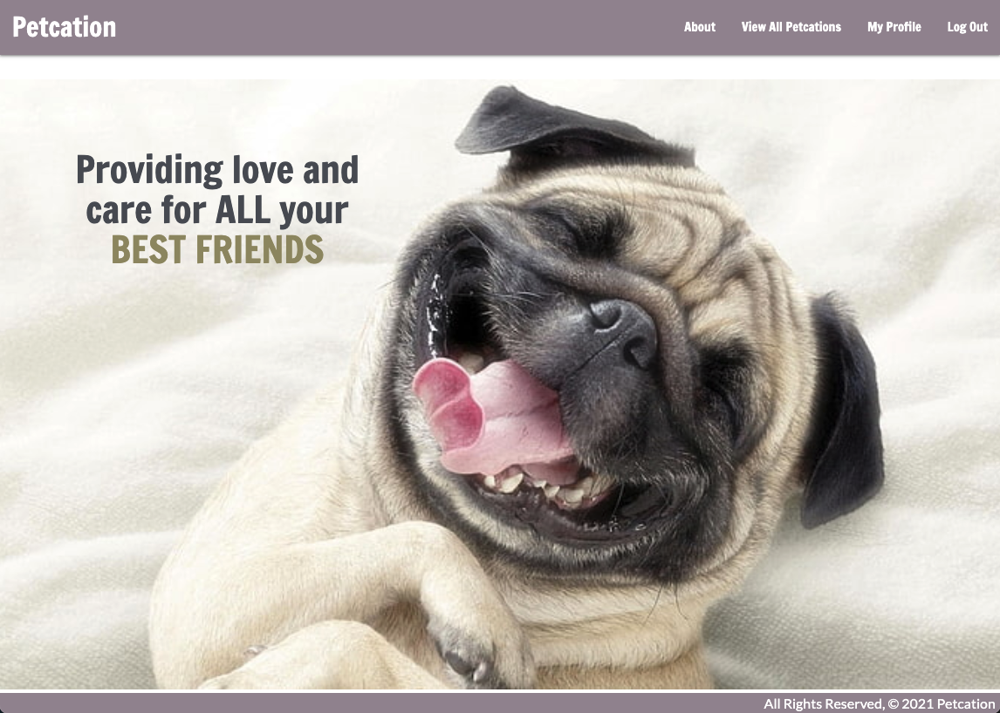
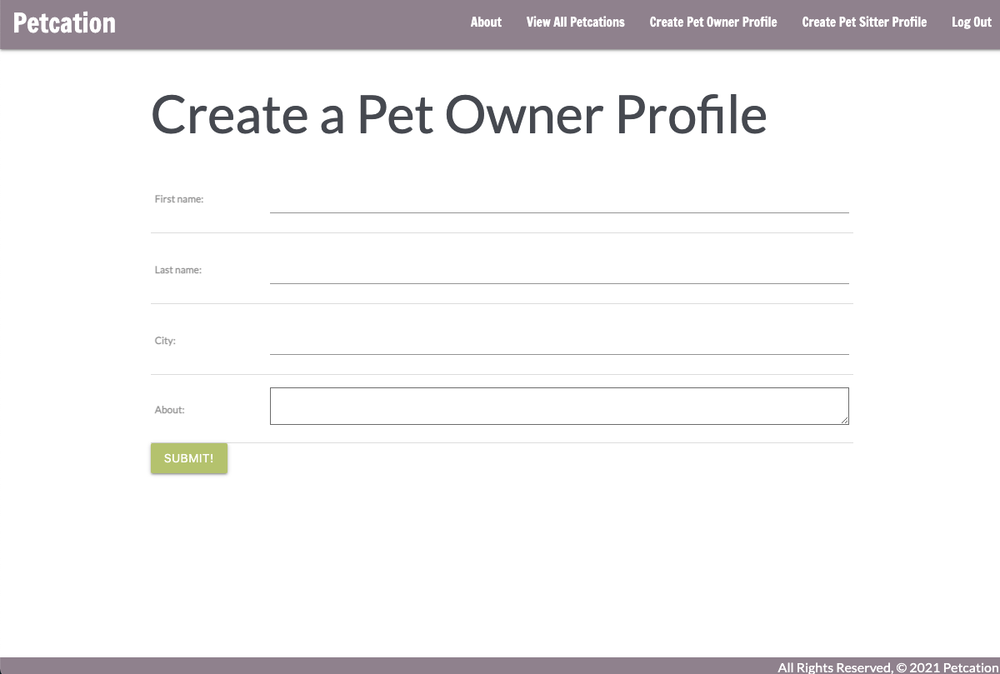
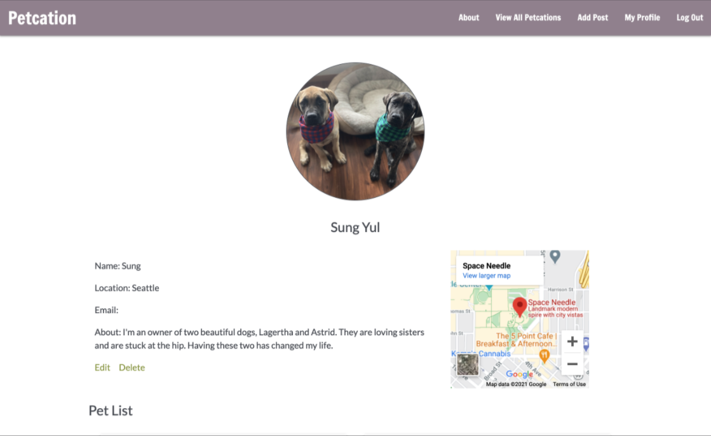
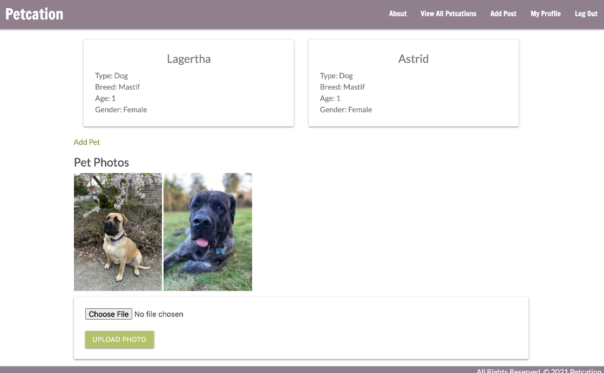

# Petcation

Petcation provides a community for pet owners and pet sitters to connect. Users can sign up and create either an owners profile or sitters profile. They can also customize their page by adding photos and writing descriptions of their pets. As pet owners, we often reach out to our closest, most trusted friends to care for our loving animals. Our friends are also happy to care for your pets when time permits for them. Without the pressure and obligation to ask (and respond), Petcation allows pet owners to post petcations aka posts for pet sitters. Our friends are then able to see available dates and respond to pet sit voluntarily. Best of all, our animals get a chance to take a petcation with our friends! 

### Home page 

### Petcations page - to see pet sitting posts

### Pet sitter sign up

### Example owner profile

## Technologies Used 
- HTML
- CSS
- Javascript
- Python
- Django
- PostgreSQL
- Materialize
- Heroku

## Getting Started

[Click here to start your Petcation!](https://petcation.herokuapp.com/)

[View our Trello board here](https://trello.com/b/6jDEKGDa/project-3)

## Next Steps
- Fix user functionality by only being able to edit your own profile
- Allow the pet sitter to send and post updates to the owner with specific details during pet sit, including: pictures, map pins and feeding schedules
- Allow owners to leave personalized thank you messages on the pet sitters page

